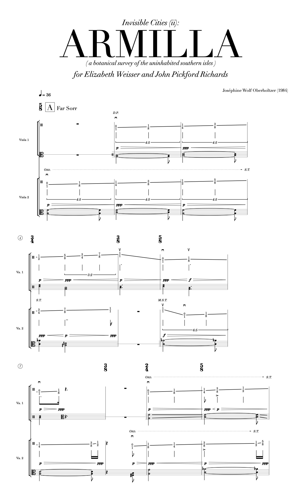

# Invisible Cities (ii): Armilla

> [!IMPORTANT]  
> :transgender_flag: I've made some changes in my life.
>
> Please visit https://github.com/josephine-wolf-oberholtzer/armilla for any subsequent updates.
>
> Love, Joséphine

Invisible Cities (ii): Armilla (2014) for viola duet

Written for Elizabeth Weisser and John Pickford Richards

